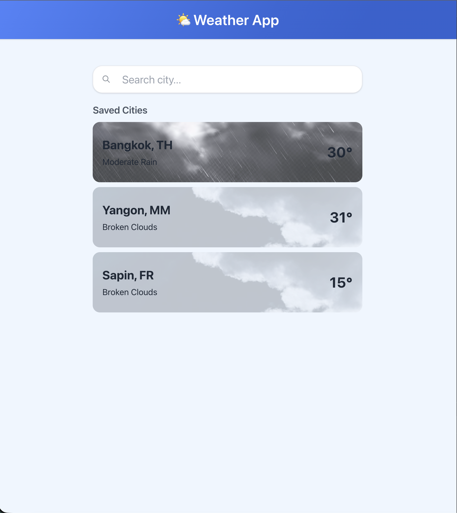
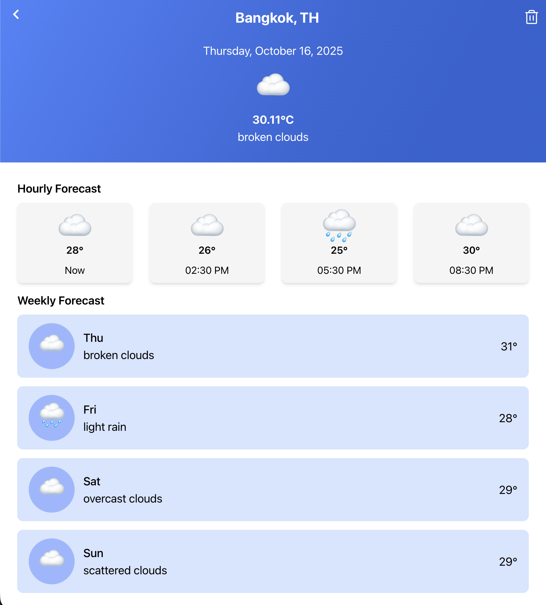

## Getting Started

clone this repository and run the development server:

```bash
npm install
# or
yarn
# or
pnpm install
```

Then, run the development server:

```bash
npm run start
# or
yarn start
# or
pnpm dev
```

## Preview





## Demo
[Live here 💻](https://react-weather-soe.netlify.app/)
